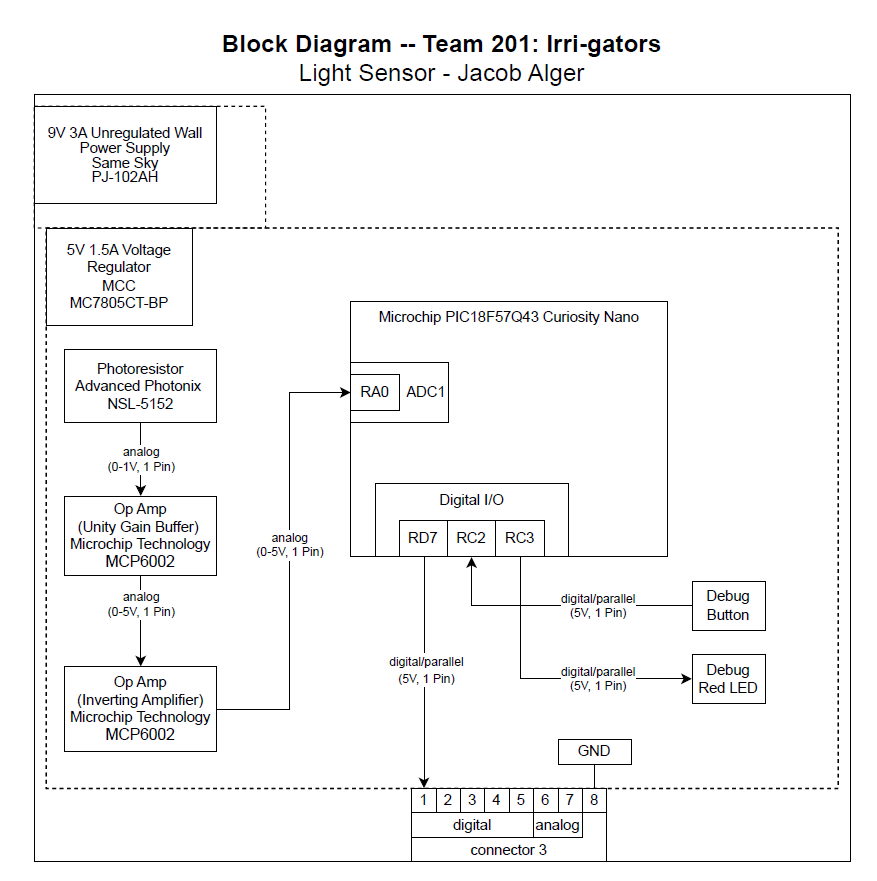

## Overview
To understand the light sensor subsystem, I have included my individual block diagram, which is available in several formats for your review. My subsystem will feature a photoresistor, which will be connected to a unity gain buffer to condition the signal, and then to an inverting amplifier, which will amplify and invert the signal for further processing. This will produce an amplified analog output, which can then be processed by the microcontroller and tested to determine if the light levels are too low. When the light level is too low, the microcontroller sends a digital high signal to the speaker subsystem to alert the user.

There are two power levels: a 9V power level supplied by the barrel jack adapter and a 5V power level supplied by the voltage regulator component. The unregulated 9V level will be regulated by the 5V voltage regulator, which will then be used to power the op-amp and photoresistor, creating my analog signal. The final pins and connections between boards may change during the prototyping phase, but these connections should work if all goes well.

## Block Diagram 
My block diagram can be seen in draw.io ["here"](), as a PDF ["here"](../01-Block-Diagram/individual-block-diagram-rev5.drawio.pdf), and as an SVG image ["here"](../01-Block-Diagram/individual-block-diagram-rev5.drawio.svg)

{style width:"350" height:"300;"}
