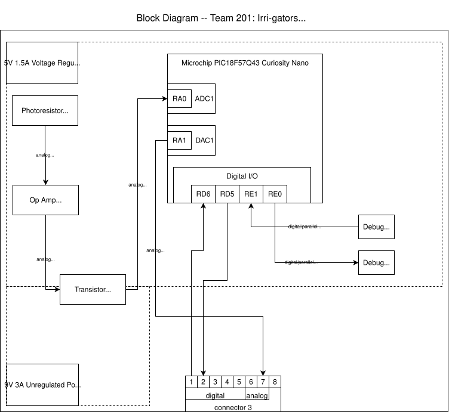

## Overview
To get a better idea of my PCB design for Team 201's project, I created a block diagram of my light sensor component. My PCB will utilize the Wheatstone Bridge light detector design to measure the sunlight and give an output based on how much light is being received. This sensor will connect to the hub of our project to talk to the speaker actuator to alert if the plant is not getting enough light.

There are two power levels: a 9V power level supplied by the barrel jack adapter and a 5V power level supplied by the voltage regulator component. These will both be used to control the op-amp and transistor to measure the Wheatstone Bridge readings from the photoresistor. This design should allow for the sunlight to be measured and report an analog output to speak to the speaker.

This design is subject to change as the project progresses and I learn more about how to properly input the Wheatstone Bridge light detector, and how exactly I need to talk to my teammates' boards.

## Block Diagram 
My block diagram can be seen in draw.io ["here"](https://viewer.diagrams.net/?tags=%7B%7D&lightbox=1&highlight=0000ff&edit=_blank&layers=1&nav=1&title=individual-block-diagram.drawio&dark=auto#R%3Cmxfile%3E%3Cdiagram%20name%3D%22Page-1%22%20id%3D%22D7A3hRXi8sjnXgM3Vncy%22%3E7V1bd9o4EP41nNM8OMd34JEAabun2c0m2263bwKEcWNbrCwC5Nev5Bu2JV8IGHCXl2DJki3rm288mhk5HW3obj5isFw8oBl0Oqo823S0UUdVe2aP%2FmUV27BC1%2FphhYXtWVil7Cqe7TcYVcpR7cqeQT%2FTkCDkEHuZrZwiz4NTkqkDGKN1ttkcOdm7LoEFuYrnKXD42r%2FtGVlEj2XIu%2FpP0LYW8Z0VOTrjgrhxVOEvwAytU1XauKMNMUIkPHI3Q%2BiwuYvnJex3X3A2GRiGHqnTYey67qMxXZtv6LG%2F%2Fva4HS0sKbrKK3BW0QNHgyXbeAYwWnkzyC4id7S79cIm8HkJpuzsmkJO6xbEdWhJoYdz23GGyEGYlj3k0UZ3rxATm07owLEtj1YTxPq46BVMgluwbhj69lu6jAggqTIVKpguw5mdLjpo%2BpKMMJKE1Gl%2BpuLHpkODm1RVNHMfIXIhwVvaJDob4x1JsRkV1zuR6MZNFilxMPWoEkRiaCVX3iFFDyKwxMBNty7%2B8Tzu48f5ZwBG30cf4YOkas0jNwP%2BIuiutA8wMwtYTwCYJgBMVxoDTL8Ctgdgep9HTNUFiKnyERD7MR%2F%2BVAj6vnpeDSVjvsJvf3YlxeAQe7CnGE0X9pJWP34eKr17o%2FunTqkoD1fYRr5N2BP9Djx0GLZinSlAvGUga1oW5eRtmUbZFKFsHAFl4RtQU7sCYpoOYfNlv2ZANP9dsbf13Rx5RPIDW2VAGyjmcrM7SY%2Bs6De4yOT9lwgQoWdHNrAwcOmRJNE%2Ff8HgmPYKO3%2FG2JYsQBD245vSqZjkB0LrggfK1h70jL%2BBKWLPN3AsiIvukyMCFRWSlXafYPQCc5ItEHYQsWFKBZDejqeJa89m7DZCemUJyB4vsjYVs31E6ud5xNHIFNHIbEpXCl5mcEYN6aiIMFkgC3nAGe9qc4js2nxBTN0FU%2FUTErKNcAIrgrKCQ%2BcPb7%2Bz%2FrdGXPwnulxQGG0ypW1c2tgk1Y2W%2FomvSI93nVgh7nMRAuKjFZ7CMhziNRLAFiQlak8xo5YMplKJw9ABxH7NrodEAhR1fUQ2HfXOclZzpnMvJ4PhUKNeOzEcYAy2qWZL1sAvvo%2Bee7XovdxyKNde65e2pwfhCHacSObk%2FTTRz0MTobjLpeJeRC2lgloXR5MC6Zd5nogJJZ%2BGJppeQZPwmQ6midbNib22J02049JECE%2Bv3CILDYuZbVFhode6pxIAHIf5nSoNnbDqg%2FGto9KhmcBlloE38dmPwox627upaceckLhKmrYJiY9L3JRB1GsNj7Wab7tuTRJHQi%2FJt0pPiaTwvcSOm6D53IckR5qj0IR3AY3gZGUJBP5uRQjyagr2XivVU8rJzMa0wkbM1F9Dn5SJzh6Oh5xvL9GQaWNa5CpqakWqGKZA%2F%2BVAsihKl%2BtHTfzxUe9O2uUtdAzk3D%2BJ4zQFgtLUiqYABd4vED0UXZOqsnYYb%2FJL1wmiDHXPDmiFQFaT6ox48VZDYiJckeKRipimCogmC4BTmwOuzwEHqJWErCtuJRozAakYR7G7vCkYY2anYFQOQ7DlQKV92qdFgo%2FqHhhrajkSm0KKnBgYlQPmQDPi1wBGYOydGBh%2BKaVfgRHmOZwYGD5qblyBEeYznBgYPjhuXoEpiGifFhnee9C9IkPPnv%2F1z3sUeldk6NkTvv%2FFuVm8XSZwosaL0rpBBllqWZghjiUcEmaoCr1fephBLB%2F1o%2BqR8O8RadAUOXKA7Bdp2Dvyp%2BQcBrqRJk5le0MvjxTq%2FdL22UhhQ2ESMXoVCV7%2FF3afIPrfTnabPLt%2FmD8fvo6%2Fv7w9dwG8mz98BUtHij3Me5BblvvGe8jNsUsxjCx7a6bRnJRoorgVx5zHBSKIyYIfBFJq8q2kyl8CL8OqOEsxMJ4kP7SeWBLjEsOgn8yd8RB2gRNelM%2Fj7KhaP3VDOtjwnrXzK8MqxVB7zDsn%2FT4q79PWAC2XoNlMxDaXwqIIAraKIrAfj5FDLBb84oSVpVAyHduDUjy0IL2W2bYGL3x9%2Bo6RgxZfPQytFdUhdP7pKwatWcKt%2FLxaLp1tkmqMxdyIiPebpMjq4FO1GC%2FbJ3pHEKvYbR6HoEWRMdGypNuYWPGBsSOJFTNdZOXWYG2%2BIYewTXCq%2FBQK2E4rl8vTl4duTzau0vTeDUiNCZN4N0utl%2FOvawUnFm3ank2ZtwUWrU%2FtKjJgG0k7yT6EoO7eZvNfkk5ebmFfuqVcagBXWspxoKvxrNlc0rea375XaRUXLHaVrpG9UEH67XsSw4Uzy7vTBXTLpPdVkvPLuNDMbIseLrQfBRlnnEDXzvhLtg6cIONPjH4t3fw%2FSnjeZ2NOotkTNV9Ps59dA%2BeUo1AlV%2Fsk4nBoVap0v5QS8q0qx%2Fc8UCcn%2B2Zjdhn1VOm%2B%2Fkwjp7J14%2FT%2BRvEmHz6ZYDAaHpgLFS%2BtcaiOLsNgOGDjr8Gr3F5DS3axp54H6WkgH4ZR2zERZHuIUgi1pta7Ii9KDo9fLe09t%2BtLFX31QPSdisbSqHk7dBSbHfJnesU%2FDqNIS74PUyqe%2B2V%2BNoVe6W7FtFYbtTov50AkYp7ltvicTtGV7tIut%2FefRkbb129N4dk9G55l2wvTrBu3Ovf9OCgpymXBVOxOT3uun8ZyoU%2F7EEQdMIHOHZi%2BWEG3i%2FqQz5Hwzu%2BkPLM9KXgbjgbXhVjW4hREuZpaiJXmVlWxcqA0wsq2w3dKU6YsJFBuysRVzOeWASsOTE5DbcjikQ4btTQD%2BOUDtiYf5MBxKcc%2FN%2BEvO6MyxxIrpA9ubjqiJI4%2FWMB04C5TMhSOZc8UjrM%2FyIeRPZ9DJkE2cG6O9TiFKTTBV8DmwLWdbfhQT2iCCApHKYHl0oGSv%2FUJdMMqFoJ%2BeQDT56DuPhgTq%2F8EnVfIlnlhcYBttqJkhz7wfMmH2J4H45Hz3x1Tb3vLTXiKfTlMivRvMMFwToSTdHaUHoaPpizr1fDUySNqi3prJljTzWZlaKKsjKaSfUpjmxeu8f7ClFj5HLs9lYRg2JVkm4NptkeTGqNwMOUKTaheuI8vDg29W03VOlPaFgZz%2BXtH4G9%2BUaCfMltPTGDRp5OvmTDHzISJI7Z1dpK0Ig5bmRoTvxWqt4hoYrocmgmjZqOuSv6zyHUzYbjsWq2Z8G2yykw%2B%2BFy%2BHSXfPs7QeeeH6Ghx9%2Bn9sPnu%2Fxdo4%2F8A%3C%2Fdiagram%3E%3C%2Fmxfile%3E)

