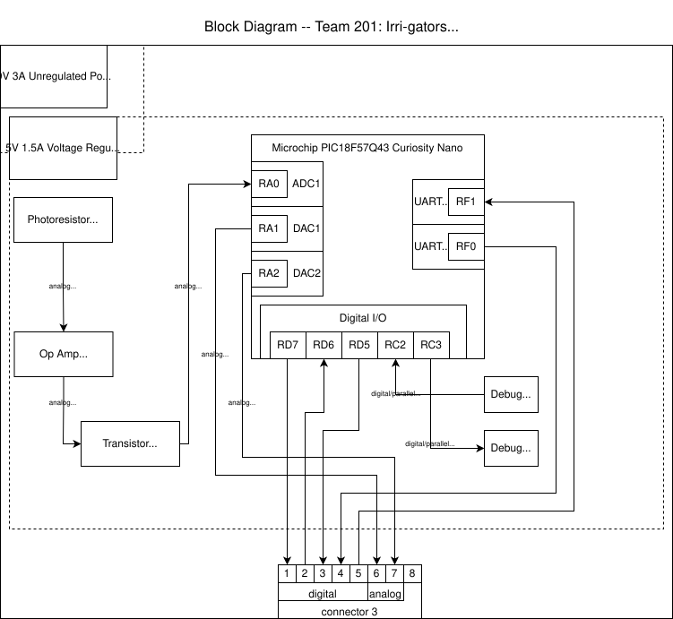

## Overview
To get a better idea of my PCB design for our project, I created a block diagram of my light sensor subsystem. My PCB will utilize the Wheatstone Bridge light sensor design to measure the sunlight and give an output based on how much light is being received. This sensor will connect to the hub of our project to talk to the buzzer actuator to alert if the plant is not getting enough light.

There are two power levels: a 9V power level supplied by the barrel jack adapter and a 5V power level supplied by the voltage regulator component. The 5V power level will be used to control the op-amp to measure the Wheatstone Bridge readings from the photoresistor and control the transistor switch, which sends the signal to the microcontroller. This design will send a signal when the sunlight is too low, which will send a report signal to the buzzer subsystem.

This design is subject to change after the design review and after I learn more about how to properly input the Wheatstone Bridge light detector and how exactly I need to talk to my teammates' boards.

## Block Diagram 
My block diagram can be seen in draw.io ["here"](https://viewer.diagrams.net/?tags=%7B%7D&lightbox=1&highlight=0000ff&edit=_blank&layers=1&nav=1&title=individual-block-diagram.drawio&dark=auto#R%3Cmxfile%3E%3Cdiagram%20name%3D%22Page-1%22%20id%3D%22D7A3hRXi8sjnXgM3Vncy%22%3E7V1be6I6F%2F41Ps%2FMBX0ICOql1XZm9p7OuHuYr3vuUo3IFIw7YFv767%2BEk5BEDlVQW29aEkIIedcpa63Elj5wX74QuJhd4QlyWpo6eWnpw5amAbWt0X%2BsZhXWGFonrLCIPYkarStu7FcUPxnVLu0J8jINfYwd315kK8d4PkdjP1MHCcHP2WZT7GTfuoAWEipuxtARa%2F9nT%2FxZWNs11HX9V2Rbs%2FjNQI3uuDBuHFV4MzjBz6kq%2FaKlDwjGfnjlvgyQwyYvnpfwucsNd5OBETT3yzxw4bruyBg%2Fm6941Hv%2BNVoNZ5YS9fIEnWX0wdFg%2FVU8AwQv5xPEOlFb%2BvnzzPbRzQKO2d1nijmtm%2FmuQ0uAXk5txxlgBxNanuM5bXT%2BhIhv0wntO7Y1p9U%2BZs%2B4%2BAk%2BBK9gjxHk2a%2FpMvahnypTqkLpMprY6aKDx4%2FJCCNKSN0WZyr%2BbDo09JKqimbuC8Iu8smKNonuxnhHVGxGxec1SXTiJrMUOZjtqBJGZGglPa%2BRohcRWHLgxiuX%2FL656JHR9BuEw%2FvhF3SlaHr9yE2gNwseB8cHmJkFDLQliOkSxNrmDhD7PR38AT6%2BX94sB4oxXZLXfzoKMATEruwxweOZvaDVo28D0L00Ov%2B0KbLqYEls7Nk%2B%2B6IfcI63w1bOghLEjwxkXedQlvBlQglplBN%2B3gZlqUDVY%2F2WYUzT8dl82U8ZEM3%2Flkz4n0%2Fx3Fe8QPX1aQNgLl7WN%2BmVFf0POnl4excBIvTu0IYWgS69UhT65xYF1%2FSp8OFvhNiKBX1MvPildCoe%2BIHQuuCDsrVbfeNfcIzZ9%2FUdC5FN7%2BEYgZKKn6V2zyf4EXGULSF2GHHDmBIgfZ3IJq49mbDXSNkry4Ds8yLjBZjHx0g9jo9ENjJlbLQLWSnlom4%2BD4WkMLEtOk20r0v67dBxmOVZSJph1SfjV0ujQzOhy7CcP3jsH2Bi2J5%2FLkl5aEItxaiIiT%2FDFp5D52Jdy9HIus13zARwAN4f5PuriHLg0sdZUkYvtn%2Bfuv6XdXVmRKXhS9RzUFjFhTlF4H7dkBX%2FjftghfVjQWklknD3UCjYw0syRnniNloSQGIhP6ddJJQZZGX4QT1rq51oDAQ50LefsusBGcVHvY2wTb9i3QRPpx4dG88SyUu30DUClwzRw9KS0Pv50vfxvCRdVzItmiSTiU1ohY2ZbH5Gnp9HORVMe074tXWJ9JNZinUJP2CYxba9RVE6mHVUtmkrWfJWsOQ4e92U2OugURUEDNGQi76TGhGaqu%2FWJH%2FAlEPdvQNaQJDFeO4RL9FoSCyEE1IiUhGnaRJGU2VLpvqA6wnAQWokYeuEW47ETEDajGO7URhjzk7BCLZD8MiBSjshmkVC9Opu6Rw8ciReNrJIw8BoAjBbmhHvAxiJsdcwMOJSqn0CRhrnaBiYtgCMcQJG07p7B0aMZpgnYFJm2f6QEb0HnRMy9O7%2B1b%2FoUeiekJEHZ%2BtC5m72czL9%2B8rtK%2FYPR%2FGtu%2BmTrgBxobIn5358Xeza7%2FVaKee%2BeqaqnVa%2Bgz8ojRCx6aSxeFdQWRXVQo98YuQW%2BuQTj02hV760C367lArROpe40mPXRNlIk6ocWaxJbW0fa1ILSPHQY01y%2BgBlCTs2jsqGmxT1TO%2BByNStFm%2FqEwJXqQYLFn3yUm%2BLw1HxGpiLdmjRWC9Ltjfaam77die3Pb0IR1xnsEyOXkFexkfh7oSjEz79cJFkOX2YInf%2FNv9c3V3cP77edCA6n17dwYWjlNZaa%2BZW1Z7xFuYWuAsYRoa7dD4IGY4%2BekrGpg0wmix6KXDOaIZ9zGjBC8JpJfktp8pbwHlLlnkUmNCKF9rQLPdoQVDwnCrcmWPiQifsVEy%2Faml6L%2FVCOtjwnaXTosKqHzffFQMYWv4DxxqjF5Kq6gnam1k%2B0CQxewAkS4hd5P3JsztLUf37VS%2BJqsiuShK9sUFVeFRg%2BX2Wp99K8vKCukubzX%2Bik6qqrkNXQbmapVAFxUusKval%2BTb7UlBBfM6t1qmqguKOANeRbmQ7CuerKV0mR0T0ckrYNJN1VcjU15R2NPX7xfDYRX1D6Vg9UbTXlY4lp4FSkv0DJaNm5XBJj1WiJMrphUOX39J1f6%2FsCqKie0A909R4EFtK72QXSrw8B%2BWEblU3g8FpiTbIdxvw7Q3QvNtAate1xchwfzjYMrElNpJJKL4Og7y32HYjEdHdmoxvucNNBOm6r26H0ZFjoknikLJ8MH0HmEjdALItHBwe7y2HuZ2FQDdECDTZnsPacmJF63UYmynqN9rjz%2B1Y5Eg2%2B%2BaSZ7U0vrrQk6qehAJTUm141KH8LZGI74IsmzUn6OQwyfbQi6u%2BoXns67268DT2hmfeVrE01w1E3fXhUAL6YcEkbhrIRgIithvoG%2F312yDqwAfknMPxoxU8dlDb6HeEd2dveEtzdEp54q6HxknKbtjivTc45VFC0bgZ9k%2Fr6gxGsrz4utbVuRkvRUK2D2oRsscOn2T9V5tlmhdPypeZcRVzuWbAikPg41C5sQC5w0atTCB5%2FESsh09q4LdW43%2Bfw%2F%2FsjsZ8nKyQvvj8uSULrf9kx9%2F03UWKhsKxVAys7%2F1DPg2wy7z%2FPiafd%2FUxG9MaggNVptC1nVX4Sdf4Afs4HKMCFwsHKd7K85EbVp079vzxCo5vgrrLYEys%2FitynhBbs4fFPrGZe4BdenDuKR4i9jQYj8of4aKddRcv4S12CIsSSd9getHUl07R3jG6GoxMVdWK4SmT23Eswq2uHIwzLhtJsiulviyMvMD4gUu8W0JZi898qigmJMMuZLcpHGefqFNmbBxMvkiTChi%2BK%2B0HVa9av5hdy0zqsXCxkFq1Ax4GnM%2B6vX8Wlh1seEqk2mUiVRyyL5Phf%2BiB%2BFw1UJypHxHb7nagbMh10rKaEvBBg7JJUxqXXg969cTv%2BfMzNZDZJpCNx78h1i7fhiXh%2FB3Hp475SNPiM2ilJ%2B6A2rbNbTa2FlL9Tq0JpMRDCzU8HZohqvceldVq0OJuTpC1pLwXJM2N8DM7F1K9WVJTZRW%2F7IHILYwo0fwvBaha%2F2uxrbA4PpOgGaoCPZGq%2BKzP3fmcNjv2t6QqZgGo4MxgbX5hx2cnf9Nlc0hfa1N8TU5Xg05XNQa3yvnow5NJifOUgWzP7i7oRCp8xINTGrXOqu13fEvqZDnzJy9xoMRGRbUh%2B4czW9q8z3NHZovwnrw0wl2ZLeJJMe9sP18pSsw%2FiiqTE5uXRbFjSqxMQHz2eadguyuXjMK1r4fgxINWDj37u6K4LEVweVHiEpJPOwh6axu5Aqu4fa%2BIPnPb10OfYgbNsL9tCs17C%2B02mDItxWhzaDAb2dU2rps%2BkPHLo6c3mFwt95SI2RMfykl6OqokXw1KNpLmHxZWZSdpN9adNZtiGsd0IP%2BkEr69wf8eFq8a%2BZNNtBzVWGbLkTgi822rHnF3FHfWb1flvL4b3Mc7c8yKnr67%2FvWtRIbc3tcRZYuVf5RWcBA8WCW%2FmdP9Eh9bo7of7HUBUSX61PwCApT9RZHkzNg9ryBMzuWhdfPFJN%2FeMAvEJL8z02xgBSHb0Hf5sTb0GdxKL%2FGk7s3mFI%2Fi3aAErk9KoFgJSH5jq1klICbUX18e9YH927NYyd9QqI%2FFxN19h%2B5KTnzH5dJUSinm%2FKPA05o5l7IPzLVndPMVrcmvRyq2j8%2FPeaNipsX1bxGHzde%2F6Kxf%2FB8%3D%3C%2Fdiagram%3E%3C%2Fmxfile%3E)

