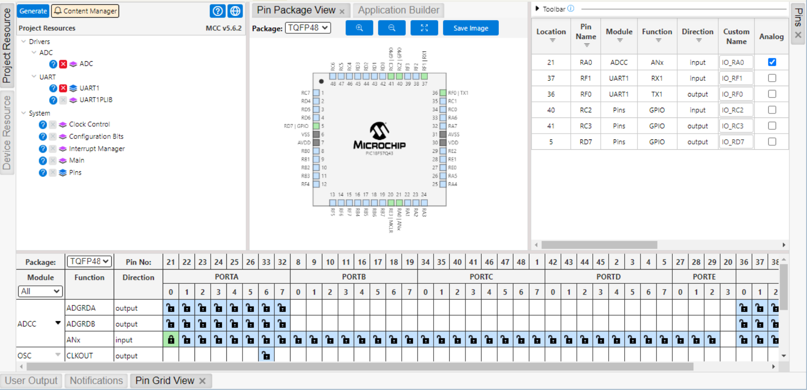

## Individual Subsystem Component Selection

For my Light Sensor subsystem in our smart garden project, I evaluated three different components for each major component of my circuit to select the best ones. This includes the op-amp and the photoresistor, both of which are required to create an analog light-sensing circuit. Then there are the power supplies, which include the barrel jack connector for a 9-volt wall power supply and the linear voltage regulator for the 5 volts required for the photoresistor and the op-amp.

The other components that are not selected are the PIC18F57Q43 Curiosity Nano Development Board, as this is the key microcontroller for the entire subsystem and project, and the wall power supply, the BestCH 9V 3.0A AC Adapter, which was provided with our kit and I feel is sufficient for my design. The microcontroller enables the conversion of analog readings to digital and back to analog for use, as well as providing timing and processing power throughout our system, and the AC power adapter can be used with a barrel jack to supply power to the board.

A summary table can be seen below in *Table 1* for a quick overview of the selected components for my project

*Table 1: Summary Table of Final Major Components Selected*

| Component Type      | Selected Option                   | Price      | Key Reason for Selection                                      |
|---------------------|------------------------------------|--------------|---------------------------------------------------------------|
| Op-Amp              | MCP6002-E/P Rail-to-Rail Op-Amp    | $0.50        | Inexpensive, sufficient functionality, 2 op-amps per chip     |
| Photoresistor       | NSL-5152 CdS Cells                 | $0.87        | Affordable, suitable resistance range, fits on PCB easily     |
| Voltage Regulator   | MC7805CT-BP Linear Voltage Regulator | $0.75        | Similar to lab kit part, easy to order, adequate performance  |
| Barrel Jack         | PJ-102AH Power Barrel Connector Jack | $0.76        | Lab kit part, small PCB footprint, good mechanical properties |

### Op-Amp

1. MCP6002-E/P Rail-to-Rail Single Supply Op-Amp

    

    * $0.50/each
    * [link to product](https://www.digikey.com/en/products/detail/microchip-technology/MCP6002-E-P/683196)

    | Pros                                      | Cons                                                             |
    | ----------------------------------------- | ---------------------------------------------------------------- |
    | Inexpensive                               | Low bandwidth (1 MHz)                                            |
    | 1.8 V - 6 V                                 | Low Slew Rate (0.6 V/μs)                                         |
    | Familiar Package                          |

1. TLV2372IP Rail-to-Rail Single Supply Op-Amp

    

    * $1.87/each
    * [Link to product](https://www.digikey.com/en/products/detail/texas-instruments/TLV2372IP/413506?s=N4IgjCBcoGwJxVAYygMwIYBsDOBTANCAPZQDaIALGGABxwDsIAuoQA4AuUIAyuwE4BLAHYBzEAF9CAJgCsUxCBSQMOAsTIgpYKRXoIWIDl16DREwgFp50RVH4BXNSUjkZzSSAswFSh040AzO4e1uQAKgAyAGpSAfTyTOJAA)

    | Pros                                                              | Cons                |
    | ----------------------------------------------------------------- | ------------------- |
    | 2.7 V - 12 V                                                      | More expensive      |
    | Good bandwidth (3 MHz)                                            | Slow Manufacturer Standard Lead Time |
    | Higher Slew rate (2.1 V/μs)                                       |

1. OPA2337PA Rail-to-Rail Single Supply Op-Amp

    

    * $3.16/each
    * [Link to product](https://www.digikey.com/en/products/detail/texas-instruments/OPA2337PA/266157)

    | Pros                                                              | Cons                |
    | ----------------------------------------------------------------- | ------------------- |
    | Good bandwidth (3 MHz)                                            | More expensive      |
    | Good Slew rate (1.2 V/us)                                         | Low Max Voltage Supply (5.5 V) |
    | Low Voltage Input Offset (500 μV), Good for precision             | Low Max Temperature (85 °C)

**Choice:** Option 1: MCP6002-E/P Rail-to-Rail Single Supply Op-Amp

**Rationale:** The MCP6002-E/P offers sufficient functionality for this design while remaining inexpensive and straightforward to use. It features 2 op-amps in one chip, which will be necessary for my circuit. The TLV2372IP would work, but it is more expensive and doesn't offer significantly more than what's needed. The OPA2337PA is overkill for a sunlight detecting circuit, especially considering its price point.

### Photoresistor

1. NSL-5152 CdS Cells

    

    * $0.87/each
    * [link to product](https://www.digikey.com/en/products/detail/advanced-photonix/NSL-5152/5423680)

    | Pros                                      | Cons                                                             |
    | ----------------------------------------- | ---------------------------------------------------------------- |
    | Inexpensive                               | Delicate Part, No packaging |
    | 10 ~ 20kOhms @ 21 lux                     | Lower Max Temperature (75 °C)                                    |
    | Similar to one provided in Lab Kit        |

1. NSL-5150 CdS Cells

    

    * $4.11/each
    * [Link to product](https://www.digikey.com/en/products/detail/advanced-photonix/NSL-5150/5039798)

    | Pros                                                              | Cons                |
    | ----------------------------------------------------------------- | ------------------- |
    | 10 ~ 20kOhms @ 21 lux                                             | Very expensive      |
    | Robust Packaging                                                  | High Dark Resistance (10 MOhms), harder to stabilize Wheatstone Bridge  |
    | Good Low Light Detection         |

1. PDV-P9203 CdS Cells

    

    * $1.15/each
    * [Link to product](https://www.digikey.com/en/products/detail/advanced-photonix/PDV-P9203/480628?s=N4IgjCBcoOwMwCYqgMZQGYEMA2BnApgDQgD2UA2iAGwAsCccIAusQA4AuUIAyuwE4BLAHYBzEAF9iAWiTQQaSPwCuRUhRABWZpJBSqyeVGWqykSoybidsygBkAIgCVtQA)

    | Pros                                                              | Cons                |
    | ----------------------------------------------------------------- | ------------------- |
    | 10 ~ 30kOhms @ 10 lux                                             | More expensive      |
    | Similar to one provided in Lab Kit                                | Delicate Part, No packaging |

**Choice:** Option 1: NSL-5152 CdS Cells

**Rationale:** The NSL-5152 is an acceptable photoresistor for sunlight detection, and its affordability helps with the PCB budget. The delicate package will be more difficult to solder, but it will be easier to fit on the board due to its small size. The resistance values should be suitable for the design of this project, which is crucial for the light sensor to function properly. The other two are very similar, but the NSL-5152 is the best by a slight margin.

### Voltage Regulator

1. LM7805T Linear Voltage Regulator

    

    * $0.33/each
    * [link to product](https://www.digikey.com/en/products/detail/taejin/LM7805T/22237260)

   | Pros                        | Cons                                       |
   | --------------------------- | ------------------------------------------ |
   | Inexpensive                 |  Inefficient, heat dissipation at higher voltage difference |
   | Output Current 1.5A         |  
   | Provided in Lab Kit         | 

1. MC7805CT-BP Linear Voltage Regulator

    

    * $0.75/each
    * [Link to product](https://www.digikey.com/en/products/detail/mcc-micro-commercial-components/MC7805CT-BP/804682)

    | Pros                                       | Cons                                  |
    | ------------------------------------------ | ------------------------------------- |
    | Inexpensive                                | Heat dissipation at higher voltage difference |
    | Output Current 1.5A                        | Slightly bulkier package |
    | Moderate efficiency  |           

1. LM1086IT-5.0/NOPB Linear Voltage Regulator

    

    * $2.36/each
    * [Link to product](https://www.digikey.com/en/products/detail/texas-instruments/LM1086IT-5-0-NOPB/363580)

    | Pros                                    | Cons                                 |
    | --------------------------------------- | ------------------------------------ |
    | Low dropout (1.5V @ 1.5A), better efficiency | Slightly more expensive        |
    | Output Current 1.5A                          | Lower Input Voltage (25 V) |
    | Good thermal handling   |      

**Choice:** Option 1: MC7805CT-BP Linear Voltage Regulator

**Rationale:** The LM7805T regulator is included in the lab kit, which helps reduce the budget. However, it is difficult to obtain through my preferred provider, Digi-Key, so I chose the MC7805CT-BP instead. It offers practically the same features, just slightly higher priced. However, the price increase is worth it for the faster shipping times and lower order quantities. The efficiency problems are important to consider, but for a simple sunlight sensor, they are not as significant.

### Barrel Jack

1. PJ-102AH Power Barrel Connector Jack

    

    * $0.76/each
    * [link to product](https://www.digikey.com/en/products/detail/cui-devices/PJ-102AH/408448)

    | Pros                          | Cons                                           |
    | ----------------------------- | ---------------------------------------------- |
    | Standard 2.0mm × 5.5mm Diameter | Can stress PCB mechanically if unplugged often  |
    | Provided in Lab Kit           |  
    | Works with most wall adapters (also provided in Lab Kit) |
    | Small size, good for PCB mounting |

1. KLDHCX-0202-B Power Barrel Connector Jack

    

    * $1.08/each
    * [Link to product](https://www.digikey.com/en/products/detail/kycon-inc/KLDHCX-0202-B/10719289)

    | Pros                          | Cons                                   |
    | ----------------------------- | -------------------------------------- |
    | Standard 2.0mm × 5.5mm Diameter | Pins not well suited for soldering |
    | Works with most wall adapters (also provided in Lab Kit) | Less durable mechanical connection |
    | Small size, good for PCB mounting |

1. PJ-083AH Power Barrel Connector Jack

    

    * $1.44/each
    * [Link to product](https://www.digikey.com/en/products/detail/same-sky-formerly-cui-devices/PJ-083AH/9830154)

    | Pros                                   | Cons                      |
    | -------------------------------------- | ------------------------- |
    | Standard 2.0mm × 5.5mm Diameter        | Takes more board space    |
    | Good for frequent plug/unplug use      | Slightly higher cost      |
    |                                        | Bulkier mechanical design |

**Choice:** Option 1: PJ-102AH Power Barrel Connector Jack

**Rationale:** Similar to the voltage regulator, the PJ-102AH Barrel Jack is already in the lab kit, but it also appears to be the best choice out of the other barrel jack connectors. Most of them are similar in specifications and price; the only differences are quality and size. The PJ-102AH Barrel Jack seems to be the best middle ground among these. It also has longer pins suitable for PCB mounting and soldering.

## MCC Configuration
Below in **Figure 1**, you can see the MCC Configuration used in this project, which helps you understand how these components will interface with my microcontroller, the PIC18F57Q43 Curiosity Nano Development Board. The picture included the pins and subsystems used, showing how the ADC subsystem reads from the op-amp and photoresistor circuit, to send a digital signal to my teammates' boards. The UART is for the PuTTY serial program, which will help me program the microcontroller based on the analog signal obtained from the ADC subsystem.

