## Component Selection

For my Wheatstone Bridge Light Sensor subsystem for our smart garden project, I have evaluated 3 different components for each major component of my circuit to evaluate them and choose the best ones. This includes the op-amp for amplifying the readings from the photoresistor, or LDR, the potentiometer to balance the Wheatstone Bridge, and the transistor to switch and send signals to the other subsystems. Then there are the power supplies, which include the barrel jack connector for a 9-volt wall power supply and the linear voltage regulator for the 5 volts required for the LDR and the op-amp.

The other component that is not selected is the PIC18F57Q43 Curiosity Nano Development Board, since this is the key microcontroller for this whole subsystem and project. This component allows for converting the analog readings to digital and back to analog for the purposes throughout our system.

### Op-Amp

1. MCP6002-E/P Rail-to-Rail Single Supply Op-Amp

    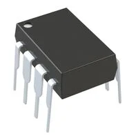

    * $0.50/each
    * [link to product](https://www.digikey.com/en/products/detail/microchip-technology/MCP6002-E-P/683196)

    | Pros                                      | Cons                                                             |
    | ----------------------------------------- | ---------------------------------------------------------------- |
    | Inexpensive                               | Low bandwidth (1 MHz)                                            |
    | 1.8 V - 6 V                                 | Low Slew Rate (0.6 V/μs)                                         |
    | Familiar Package                          |

1. TLV2372IP Rail-to-Rail Single Supply Op-Amp

    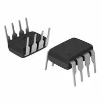

    * $1.87/each
    * [Link to product](https://www.digikey.com/en/products/detail/texas-instruments/TLV2372IP/413506?s=N4IgjCBcoGwJxVAYygMwIYBsDOBTANCAPZQDaIALGGABxwDsIAuoQA4AuUIAyuwE4BLAHYBzEAF9CAJgCsUxCBSQMOAsTIgpYKRXoIWIDl16DREwgFp50RVH4BXNSUjkZzSSAswFSh040AzO4e1uQAKgAyAGpSAfTyTOJAA)

    | Pros                                                              | Cons                |
    | ----------------------------------------------------------------- | ------------------- |
    | 2.7 V - 12 V                                                      | More expensive      |
    | Good bandwidth (3 MHz)                                            | Slow Manufacturer Standard Lead Time |
    | Higher Slew rate (2.1 V/μs)                                       |

1. OPA2337PA Rail-to-Rail Single Supply Op-Amp

    

    * $3.16/each
    * [Link to product](https://www.digikey.com/en/products/detail/texas-instruments/OPA2337PA/266157)

    | Pros                                                              | Cons                |
    | ----------------------------------------------------------------- | ------------------- |
    | Good bandwidth (3 MHz)                                            | More expensive      |
    | Good Slew rate (1.2 V/us)                                         | Low Max Voltage Supply (5.5 V) |
    | Low Voltage Input Offset (500 μV), Good for precision             | Low Max Temperature (85 °C)

**Choice:** Option 1: MCP6002-E/P Rail-to-Rail Single Supply Op-Amp

**Rationale:** The MCP6002-E/P offers enough for this design while staying inexpensive and simple to use. The TLV2372IP would work, but it is more expensive and doesn't offer too much more than what's needed, and the OPA2337PA is overkill for a sunlight detecting circuit, especially with its price point.

### LDR (Photoresistor)

1. NSL-5152 CdS Cells

    

    * $0.87/each
    * [link to product](https://www.digikey.com/en/products/detail/advanced-photonix/NSL-5152/5423680)

    | Pros                                      | Cons                                                             |
    | ----------------------------------------- | ---------------------------------------------------------------- |
    | Inexpensive                               | Delicate Part, No packaging |
    | 10 ~ 20kOhms @ 21 lux                     | Lower Max Temperature (75 °C)                                    |
    | Similar to one provided in Lab Kit        |

1. NSL-5150 CdS Cells

    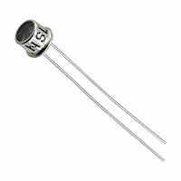

    * $4.11/each
    * [Link to product](https://www.digikey.com/en/products/detail/advanced-photonix/NSL-5150/5039798)

    | Pros                                                              | Cons                |
    | ----------------------------------------------------------------- | ------------------- |
    | 10 ~ 20kOhms @ 21 lux                                             | Very expensive      |
    | Robust Packaging                                                  | High Dark Resistance (10 MOhms), harder to stabilize Wheatstone Bridge  |
    | Good Low Light Detection         |

1. PDV-P9203 CdS Cells

    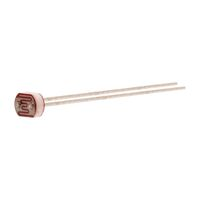

    * $1.15/each
    * [Link to product](https://www.digikey.com/en/products/detail/advanced-photonix/PDV-P9203/480628?s=N4IgjCBcoOwMwCYqgMZQGYEMA2BnApgDQgD2UA2iAGwAsCccIAusQA4AuUIAyuwE4BLAHYBzEAF9iAWiTQQaSPwCuRUhRABWZpJBSqyeVGWqykSoybidsygBkAIgCVtQA)

    | Pros                                                              | Cons                |
    | ----------------------------------------------------------------- | ------------------- |
    | 10 ~ 30kOhms @ 10 lux                                             | More expensive      |
    | Similar to one provided in Lab Kit                                | Delicate Part, No packaging |

**Choice:** Option 1: NSL-5152 CdS Cells

**Rationale:** The NSL-5152 is an acceptable photoresistor for sunlight detection, and being inexpensive helps with the budget of the PCB. The delicate package will be more difficult to solder, but it will be easier to fit on the board. The other two are very similar, but the NSL-5152 is the best by a slight margin.

### Potentiometer

1. PDB181-E425K-103B Linear 10kOhm Precision Potentiometer

    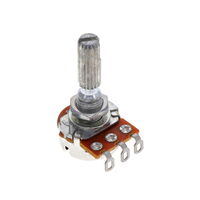
   
    * $1.30/each
    * [link to product](https://www.digikey.com/en/products/detail/bourns-inc/PDB181-E425K-103B/16356109)

    | Pros                                      | Cons                                                             |
    | ----------------------------------------- | ---------------------------------------------------------------- |
    | Inexpensive                               | Bulky Packaging                                                  |
    | Precision 10 kOhms                        | Small Pins, harder to solder                                     |
    | Similar to one provided in Lab Kit |

1. 3310R-125-103L Linear 10kOhm Potentiometer

    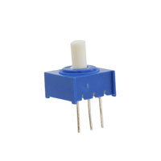

    * $3.77/each
    * [Link to product](https://www.digikey.com/en/products/detail/bourns-inc/3310R-125-103L/2537840)

    | Pros                                                              | Cons                |
    | ----------------------------------------------------------------- | ------------------- |
    | Good for PCB mounting, Rotary is on top                           | More expensive      |
    | Pins are good for soldering                                       | Less precision |
    | 1/4 W Power rating |

1. 14810A0BHSX10103KA Linear 10kOhm Potentiometer

    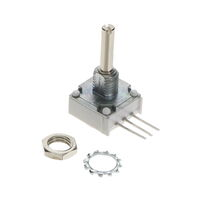

    * $15.16/each
    * [Link to product](https://www.digikey.com/en/products/detail/vishay-spectrol/14810A0BHSX10103KA/10738638)

    | Pros                                                              | Cons                |
    | ----------------------------------------------------------------- | ------------------- |
    | Pins are good for soldering                                       | Very expensive      |
    | Higher Tolerance                                                  | Low Stock |
    | High Quality |

**Choice:** Option 2: 3310R-125-103L Linear 10kOhm Potentiometer

**Rationale:** The 3310R-125-103L Potentiometer is a good choice for the PCB design, and while it is more expensive, the price is worth the ability to solder it well and adjust it easily on the board. The PDB181-E425K-103B Potentiometer is good, but it would be hard to solder and would require a lot of space on the board. And the price of the 14810A0BHSX10103KA Potentiometer is not worth the quality.

### Transistor

1. 2N2222A Single Bipolar Transistor

    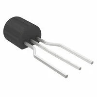

    * $0.17/each
    * [link to product](https://www.digikey.com/en/products/detail/diotec-semiconductor/2N2222A/13164037)

    | Pros                                       | Cons                                           |
    | ------------------------------------------ | ---------------------------------------------- |
    | Common component, Inexpensive              | Metal package requires careful soldering       |
    | Wider pins are nice for footprints         | Slight voltage drop in ON state     |
    | Fast switching and versatile               |                                                                                           

1. BC550CBU Single Bipolar Transistor

    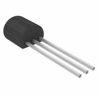

    * $0.29/each
    * [Link to product](https://www.digikey.com/en/products/detail/onsemi/BC550CBU/975565)

    | Pros                                           | Cons                                           |
    | ---------------------------------------------- | ---------------------------------------------- |
    | Low noise, good for analog amplification       | Low collector current limit (~100 mA)          |
    | Common component, Inexpensive                  | Better suited for amplification than switching |

1. MPSA06 Single Bipolar Transistor 

    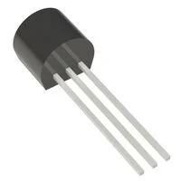

    * $0.21/each
    * [Link to product](https://www.digikey.com/en/products/detail/diotec-semiconductor/MPSA06/22193294)

    | Pros                                           | Cons                           |
    | ---------------------------------------------- | ------------------------------ |
    | High voltage rating (80V)                      | Slower switching speed         |
    | High gain at low currents                      | Higher saturation voltage      |
    | Inexpensive                                    |       |

**Choice:** 2N2222A Single Bipolar Transistor

**Rationale:** The 2N2222A Transistor is a common transistor that is good for switching, which is what the transistor is needed for in this circuit. The other two transistors are good components, but they are less effective at switching.

### Voltage Regulator

1. LM7805T Linear Voltage Regulator

    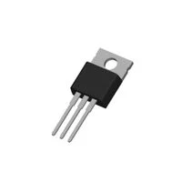

    * $0.33/each
    * [link to product](https://www.digikey.com/en/products/detail/taejin/LM7805T/22237260)

   | Pros                        | Cons                                       |
   | --------------------------- | ------------------------------------------ |
   | Inexpensive                 |  Inefficient, heat dissipation at higher voltage difference |
   | Output Current 1.5A         |  
   | Provided in Lab Kit         | 

1. MC7805CT-BP Linear Voltage Regulator

    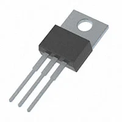

    * $0.75/each
    * [Link to product](https://www.digikey.com/en/products/detail/mcc-micro-commercial-components/MC7805CT-BP/804682)

    | Pros                                       | Cons                                  |
    | ------------------------------------------ | ------------------------------------- |
    | Inexpensive                                | Heat dissipation at higher voltage difference |
    | Output Current 1.5A                        | Slightly bulkier package |
    | Moderate efficiency  |           

1. LM1086IT-5.0/NOPB Linear Voltage Regulator

    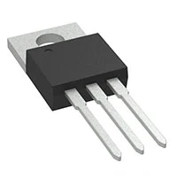

    * $2.36/each
    * [Link to product](https://www.digikey.com/en/products/detail/texas-instruments/LM1086IT-5-0-NOPB/363580)

    | Pros                                    | Cons                                 |
    | --------------------------------------- | ------------------------------------ |
    | Low dropout (1.5V @ 1.5A), better efficiency | Slightly more expensive        |
    | Output Current 1.5A                          | Lower Input Voltage (25 V) |
    | Good thermal handling   |      

**Choice:** Option 1: LM7805T Linear Voltage Regulator

**Rationale:** The LM7805T Regulator does come in the lab kit, which does help reduce the budget, but on top of that, it remains an inexpensive choice that accomplishes everything needed in the circuit, meaning that another option isn't required. The efficiency problems are important to consider, but for a simple sunlight sensor, it isn't as important.

### Barrel Jack

1. PJ-102AH Power Barrel Connector Jack

    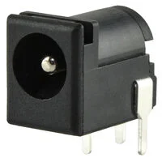

    * $0.76/each
    * [link to product](https://www.digikey.com/en/products/detail/cui-devices/PJ-102AH/408448)

    | Pros                          | Cons                                           |
    | ----------------------------- | ---------------------------------------------- |
    | Standard 2.0mm × 5.5mm Diameter | Can stress PCB mechanically if unplugged often  |
    | Provided in Lab Kit           |  
    | Works with most wall adapters (also provided in Lab Kit) |
    | Small size, good for PCB mounting |

1. KLDHCX-0202-B Power Barrel Connector Jack

    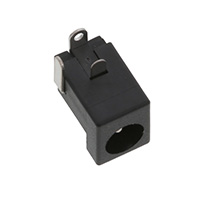

    * $1.08/each
    * [Link to product](https://www.digikey.com/en/products/detail/kycon-inc/KLDHCX-0202-B/10719289)

    | Pros                          | Cons                                   |
    | ----------------------------- | -------------------------------------- |
    | Standard 2.0mm × 5.5mm Diameter | Pins not well suited for soldering |
    | Works with most wall adapters (also provided in Lab Kit) | Less durable mechanical connection |
    | Small size, good for PCB mounting |

1. PJ-083AH Power Barrel Connector Jack

    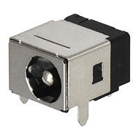

    * $1.44/each
    * [Link to product](https://www.digikey.com/en/products/detail/same-sky-formerly-cui-devices/PJ-083AH/9830154)

    | Pros                                   | Cons                      |
    | -------------------------------------- | ------------------------- |
    | Standard 2.0mm × 5.5mm Diameter        | Takes more board space    |
    | Good for frequent plug/unplug use      | Slightly higher cost      |
    |                                        | Bulkier mechanical design |

**Choice:** Option 1: PJ-102AH Power Barrel Connector Jack

**Rationale:** Similar to the voltage regulator, the PJ-102AH Barrel Jack is already in the lab kit, but it also appears to be the best choice out of the other barrel jack connectors. Most of them are similar in specifications and price; the only differences are quality and size, and the PJ-102AH Barrel Jack seems to be the best middle ground of all of these. It also has longer pins suitable for PCB mounting and soldering.
