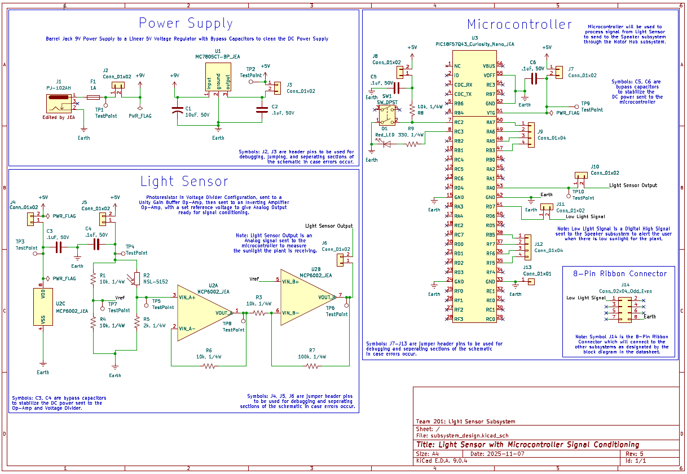

## Overview

This schematic is designed to support a light sensor that detects the amount of sunlight the plant receives and alerts the user if the plant is not receiving sufficient light. The schematic includes a regulated power supply, a photoresistor voltage divider configuration, an op-amp for buffering and amplification, and the microcontroller, which sends a signal when the plant requires more sunlight. The power supply regulates a 9V wall power supply to a linear 5V supply, which is used throughout the rest of the schematic. The sensor portion utilizes a photoresistor in a voltage divider, which is sent to a unity-gain buffer and then to an inverting amplifier with a fixed reference voltage. The amplified analog signal is then sent to the microcontroller for signal processing. The microcontroller will then read this signal, and when it is low, it will send a digital signal to my teammate's speaker board, which will be interpreted and used to alert the user. This connection is made using an 8-pin ribbon connector, as shown in the schematic. The schematic also contains several extra connectors for debugging, corrections, and test points. This subsystem meets the user's needs by providing an amplified analog signal and will assist the user with reliable alerts about the plant's light needs. 
 
The schematic is shown in **Figure 1** below, and the PDF/ZIP files are available in the *Resources* section below.
 

{style width:"350" height:"300;"}
**Figure 1:** Light Sensor Subsystem Schematic.

## Resouces

The schematic as a PDF download is available [*here*](subsystem_design.pdf), and the Zip folder of the project [*here*](subsystem_design-rev5.zip).
