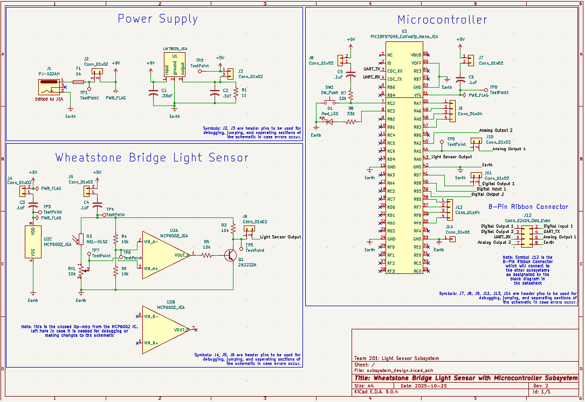

## Overview

This schematic is designed to support a light sensor to sense how much sunlight the plant is getting, and alert the user if the plant is getting insufficient light. The schematic includes a regulated power supply, a Wheatstone bridge LDR sensor, and the microcontroller, which will send a signal when the plant needs more sunlight. The power supply regulates a 9V wall power supply to a linear 5V to be used in the rest of the schematic. The sensor portion utilizes a Wheatstone bridge consisting of the LDR, potentiometer, and two balancing resistors to generate a steady voltage difference. This is then amplified by the operational amplifier and sent to the transistor, which acts as an NPN switching transistor to send either a high or low digital signal to the microcontroller. The microcontroller will then read this signal, and when it is low, it will send a converted analog signal to my teammates' boards to be interpreted and acted upon. This connection is done using an 8-pin ribbon connector, which can be seen in the schematic. The schematic also contains several extra connectors for debugging, corrections, and test points. This subsystem meets the user's needs by giving an accurate reading of the sensor using the balanced Wheatstone bridge, and will assist the user with reliable alerts about the light needs of their plant. 
The schematic can be seen in **Figure 1** below, and PDF/ZIP files can be found in the *Resources* section below.
 

{style width:"350" height:"300;"}
**Figure 1:** Light Sensor Subsystem Schematic.

## Resouces

The schematic as a PDF download is available [*here*](subsystem_design.pdf), and the Zip folder of the project [*here*](subsystem_design-rev2.zip).
