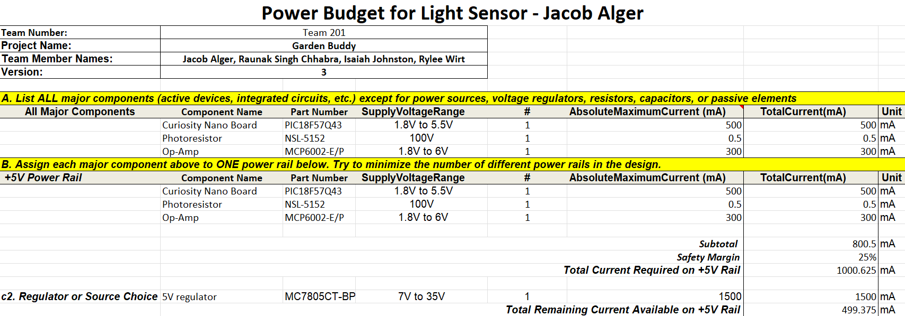
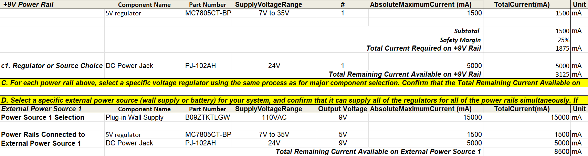

## Overview

In order to verify that my component selection and circuit design will work, I filled out this power budget to verify that I will have enough current from my power sources to power my whole circuit. In each section, the components are listed with their voltage and current draw so that the calculator can make sure there is no current deficit, while accounting for a safety margin of 25%. Section A contains the major electronic components of my design that will draw a meaningful amount of current, including the power regulators and sources used. Then, in Section B, each component is assigned to a power rail, which is each voltage level that my circuit needs to run, to once again verify that the selected regulator or source will provide enough current. Finally, in Section D, the external power supply is verified to be capable of powering the whole circuit. You can see my power budget in **Figure 1**, and the power budget is available as both PDF/XLSX files in the *Resources* section below.

{style width:"350" height:"300;"}
 
{style width:"350" height:"300;"}
**Figure 1: Power budget for Light Sensor Subsystem**

## Conclusions

From the prepared Power Budget, you can see that there is plenty of current to power my whole circuit, which makes sense as it is a simple light sensor with not many parts that draw large amounts of current. This confirms that my design, as long as it is built correctly, should not have any major issues power-wise, but to meet safety requirements, my subsystem will include a 1 Amp fuse to stop any unexpected large current draws.

## Resources

The power budget as a PDF download is available [*here*](Power_Budget-rev3.pdf), and a Microsoft Excel Sheet [*here*](EGR304-Power_Budget.xlsx).
