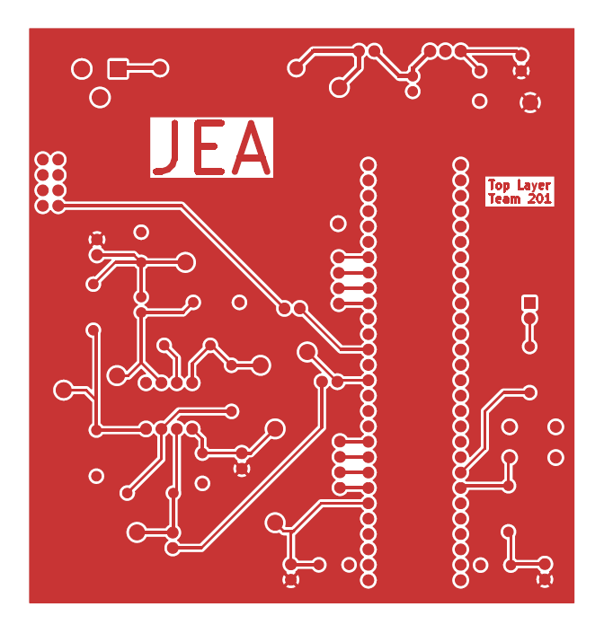
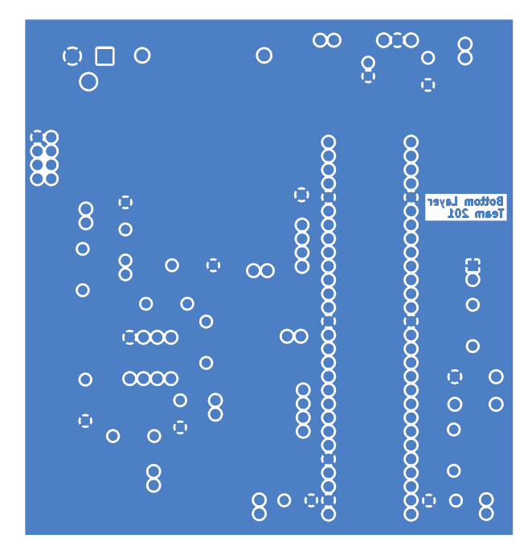

## Overview
These are the top and bottom layers of the PCB I made for my light sensor subsystem. It features everything shown in the ***Schematic*** page, placed on a board within the 100x100mm constraints given. The board is in accordance with the Peralta Mill PCB Design Rules and passed the DRC in KiCad.

## PCB
The top and bottom layers of my PCB design can be seen in **Figure 1** and **Figure 2** below. They are available as a PDF file, and the KiCad Project ZIP file, in the *Resources* section below.
 

**Figure 1: Top Layer of the PCB Design**

**Figure 2: Bottom Layer of the PCB Design**

## Resouces

The top and bottom layers as a PDF download is available [*here*](subsystem_design_pcb.pdf), and the Zip folder of the KiCad project [*here*](subsystem_design_pcb.zip). The Gerber files used to manufacture this board can be found [*here*](JacobAlger201.zip).
