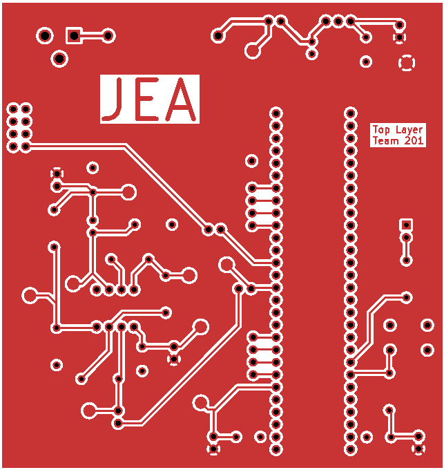
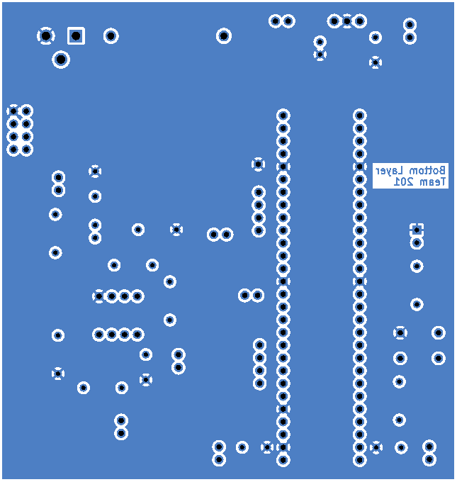
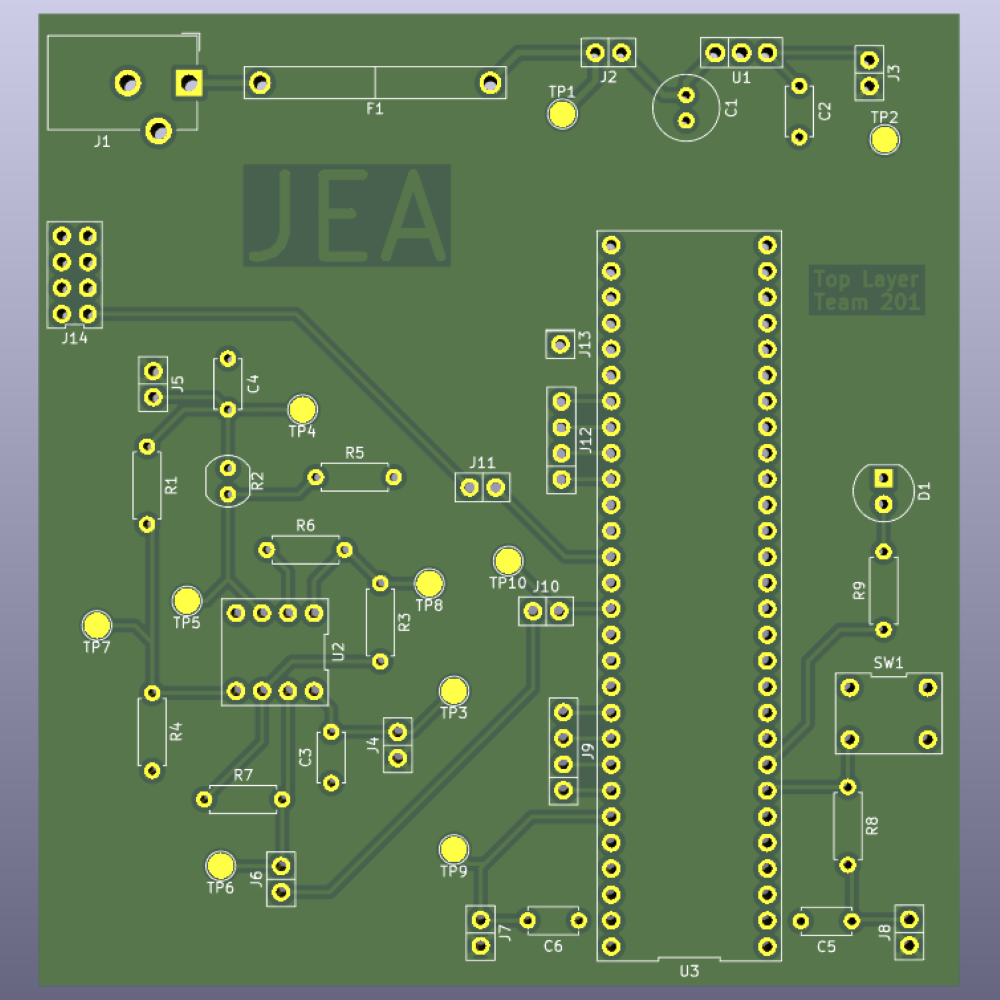
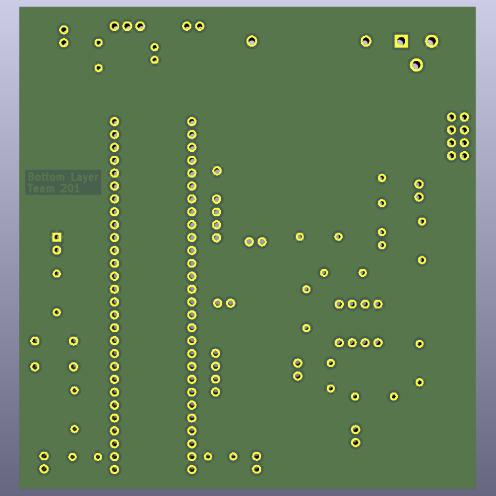
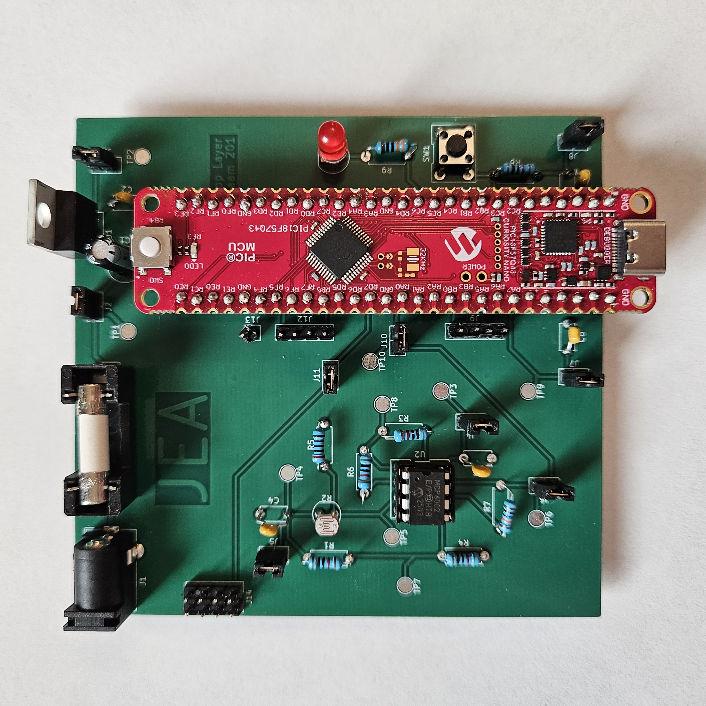
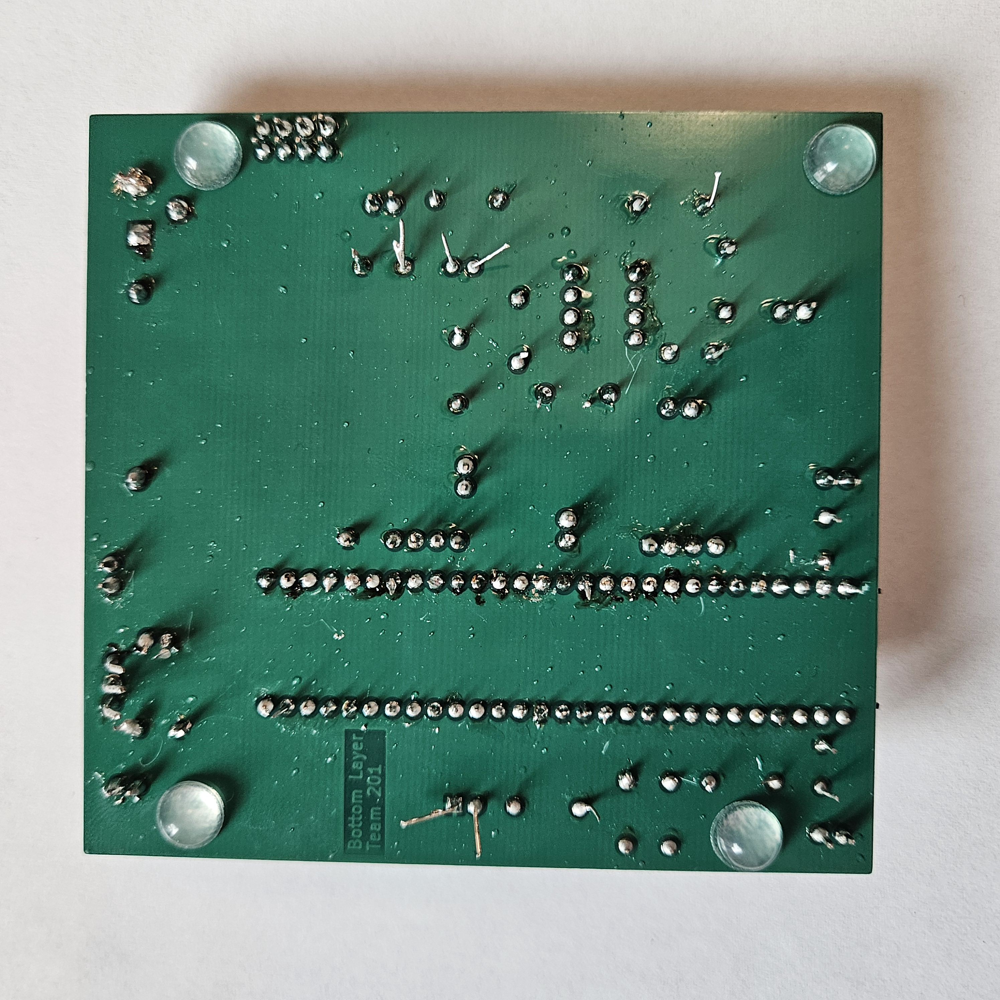

## Overview
This page includes the process of manufacturing my PCB from ECAD to soldering every component onto the final board. The PCB design features everything shown in the ***Schematic*** page, placed on a board within the 100x100mm constraints given. The board is in accordance with the Peralta Mill PCB Design Rules and passed the DRC in KiCad. Due to unforeseen issues with the Peralta PCB Mill, we switched to manufacturing our boards from JLCPCB, which had some added benefits of allowing us to have a soldermask, with a silkscreen printed on top, as well as 5 copies of our boards, which gave us peace of mind in testing and soldering our boards. For my board, I encountered minimal issues with the PCB design, and it functioned as expected, as demonstrated in the YouTube video below in the *PCB* section.

## PCB
The top and bottom layers of my PCB design can be seen in **Figure 1** and **Figure 2** below. They are available as a PDF file in the *Resources* section below. The ZIP folder for my entire KiCad project, and the Gerber files used to manufacture my board, given to JLCPCB, can also be found in the *Resources* section below.
 

**Figure 1: Top Layer of the PCB Design**

**Figure 2: Bottom Layer of the PCB Design**

Below is a 3D render of the PCB board without any components populated. **Figure 3** is the top layer and **Figure 4** is the bottom layer.

**Figure 3: 3D Rendered Top Layer of the PCB Design**

**Figure 4: 3D Rendered Bottom Layer of the PCB Design**

Finally, below are photos of my final design with components populated and soldered, with functionality tested and verified. **Figure 5** is the top layer and **Figure 6** is the bottom layer. A video of my design with functionality highlighted can be found here. 

**Figure 5: Final Top Layer of the PCB Design**

**Figure 6: Final Bottom Layer of the PCB Design**

## Resources

The top and bottom layers as a PDF download is available [*here*](subsystem_design_pcb-rev2.pdf), and the Zip folder of the KiCad project [*here*](subsystem_design_pcb-rev2.zip). The Gerber files used to manufacture this board can be found [*here*](JacobAlger201.zip).
